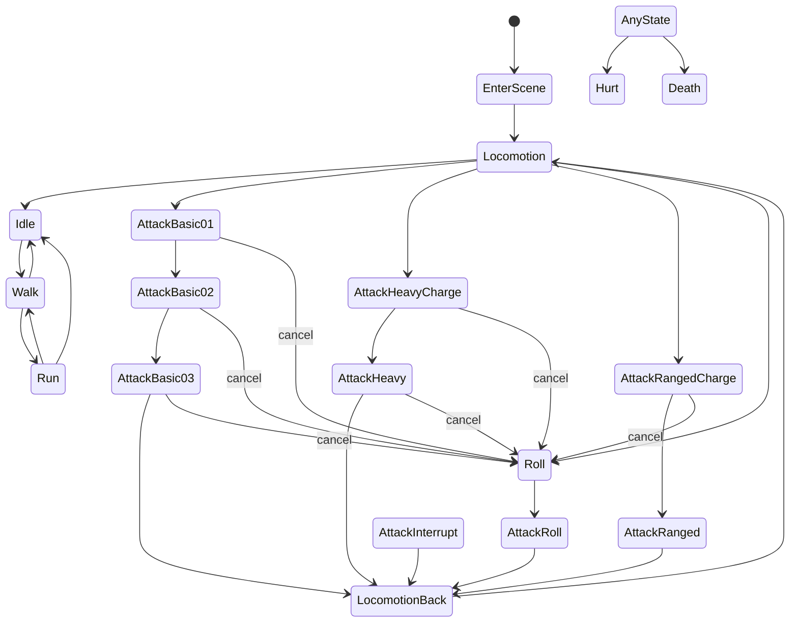

# Animation System Guide

This document explains how the animation system works, what each important file does, and how to use it.


## What This System Does

At a high level, this system:
1. Reads animation clips from asset files.
2. Runs an animation graph (a visual logic network).
3. Blends clips together using named parameters like speed or attack weight.
4. Produces a final character pose each frame.
5. Sends that pose to the animated model renderer.

## Big Picture Data Flow

1. A scene object definition file (.tgo) says which model, graph, and clip properties to use.
2. Game object factory code creates components for animated mesh and graph runtime.
3. The graph runtime loads the .tgscript graph and maps object properties into runtime properties.
4. Graph nodes such as Read Animation Clip Property, Play Clip, Blend Pose, and Adjust Speed are evaluated every frame.
5. The graph outputs a Pose value.
6. That pose is applied to the animated mesh and rendered.

## File Map: What Each File Does

## Game Layer (Project Integration)

| File | What it does |
|---|---|
| [Source/Game/source/GameObjectFactoryRegistrations.cpp](../Source/Game/source/GameObjectFactoryRegistrations.cpp) | Connects scene object data to runtime components. If an object has animation_graph, it adds AnimatedMeshComponent and AnimationGraphComponent.  
| [Source/Game/source/AnimatedMeshComponent.h](../Source/Game/source/AnimatedMeshComponent.h) | Declares the component that renders skinned/animated models.  
| [Source/Game/source/AnimatedMeshComponent.cpp](../Source/Game/source/AnimatedMeshComponent.cpp) | Applies generated pose to the model instance and renders it.  
| [Source/Game/source/AnimationGraphComponent.h](../Source/Game/source/AnimationGraphComponent.h) | Declares the game-facing animation graph component API.  
| [Source/Game/source/AnimationGraphComponent.cpp](../Source/Game/source/AnimationGraphComponent.cpp) | Owns runtime lifecycle: initialize graph, update every frame, set parameters, apply generated pose.  
| [Source/Game/source/AnimationGraphRuntime.h](../Source/Game/source/AnimationGraphRuntime.h) | Declares lower-level runtime that evaluates graph scripts and stores runtime properties.  
| [Source/Game/source/AnimationGraphRuntime.cpp](../Source/Game/source/AnimationGraphRuntime.cpp) | Converts object properties to runtime properties, ensures defaults, runs script graph, collects root motion/events, outputs pose.  
| [Source/Game/source/AnimationEventQueue.h](../Source/Game/source/AnimationEventQueue.h) | Event queue interface for animation events (for example hit windows).  
| [Source/Game/source/AnimationEventQueue.cpp](../Source/Game/source/AnimationEventQueue.cpp) | Event queue implementation (push, pop, drain).  
| [Source/Game/source/AnimationEventDispatcherComponent.h](../Source/Game/source/AnimationEventDispatcherComponent.h) | Drains animation events once per frame and dispatches them to listeners/PostMaster.  
| [Source/Game/source/AnimationEventListener.h](../Source/Game/source/AnimationEventListener.h) | Declares the local listener interface and event context payloads.  
| [Source/Game/source/AnimationDemoToggleComponent.h](../Source/Game/source/AnimationDemoToggleComponent.h) | Declares demo controls for changing/blending clips at runtime.  
| [Source/Game/source/AnimationDemoToggleComponent.cpp](../Source/Game/source/AnimationDemoToggleComponent.cpp) | Demo input behavior: Left/Right switch active clip, Home returns to idle, Up/Down blends to neighbor clips.  
| [Source/Game/source/GameWorld.cpp](../Source/Game/source/GameWorld.cpp) | Registers script node sets once at startup, including animation nodes.  

## Engine Layer (Animation and Script Core)

| File | What it does |
|---|---|
| [Source/Engine/tge/animation/Animation.h](../Source/Engine/tge/animation/Animation.h) | Core animation data container loaded from source assets.  
| [Source/Engine/tge/animation/AnimationClip.h](../Source/Engine/tge/animation/AnimationClip.h) | Defines clip metadata: source path, start/end time, loop settings, sync settings, events.  
| [Source/Engine/tge/animation/AnimationClip.cpp](../Source/Engine/tge/animation/AnimationClip.cpp) | Loads/saves .tgac clip files and event markers.  
| [Source/Engine/tge/animation/AnimationPlayer.h](../Source/Engine/tge/animation/AnimationPlayer.h) | Declares time stepping and pose sampling from animation data.  
| [Source/Engine/tge/animation/AnimationPlayer.cpp](../Source/Engine/tge/animation/AnimationPlayer.cpp) | Steps animation time and computes current interpolated pose.  
| [Source/Engine/tge/animation/Pose.h](../Source/Engine/tge/animation/Pose.h) | Pose structures used across the animation system.  
| [Source/Engine/tge/animation/PoseGenerator.h](../Source/Engine/tge/animation/PoseGenerator.h) | Common interface for pose generators used by graph nodes.  
| [Source/Engine/tge/animation/Skeleton.h](../Source/Engine/tge/animation/Skeleton.h) | Skeleton data definitions.  
| [Source/Engine/tge/animation/Skeleton.cpp](../Source/Engine/tge/animation/Skeleton.cpp) | Skeleton implementation details.  
| [Source/Engine/tge/animation/Script/AnimationNodes.h](../Source/Engine/tge/animation/Script/AnimationNodes.h) | Declares animation node registration entry point.  
| [Source/Engine/tge/animation/Script/AnimationNodes.cpp](../Source/Engine/tge/animation/Script/AnimationNodes.cpp) | Registers animation node types in the script node registry.  
| [Source/Engine/tge/animation/Script/PlayClipNode.h](../Source/Engine/tge/animation/Script/PlayClipNode.h) | Declares node that turns a clip reference into a playable pose generator.  
| [Source/Engine/tge/animation/Script/PlayClipNode.cpp](../Source/Engine/tge/animation/Script/PlayClipNode.cpp) | Plays clip over time, handles looping/non-looping behavior, and emits crossed clip events.  
| [Source/Engine/tge/animation/Script/BlendAnimationNode.h](../Source/Engine/tge/animation/Script/BlendAnimationNode.h) | Declares node that blends two pose streams.  
| [Source/Engine/tge/animation/Script/BlendAnimationNode.cpp](../Source/Engine/tge/animation/Script/BlendAnimationNode.cpp) | Blends poses and root motion. Uses edge short-circuiting so fully hidden branches are not unnecessarily advanced.  
| [Source/Engine/tge/animation/Script/AdjustAnimationSpeedNode.h](../Source/Engine/tge/animation/Script/AdjustAnimationSpeedNode.h) | Declares node that scales animation playback speed.  
| [Source/Engine/tge/animation/Script/AdjustAnimationSpeedNode.cpp](../Source/Engine/tge/animation/Script/AdjustAnimationSpeedNode.cpp) | Applies speed scaling to incoming pose generator.  
| [Source/Engine/tge/animation/Script/EvaluatePoseNode.h](../Source/Engine/tge/animation/Script/EvaluatePoseNode.h) | Declares node that writes final pose output property.  
| [Source/Engine/tge/animation/Script/EvaluatePoseNode.cpp](../Source/Engine/tge/animation/Script/EvaluatePoseNode.cpp) | Pushes evaluated pose to a model_pose property used by runtime.  
| [Source/Engine/tge/script/Nodes/CommonNodes.cpp](../Source/Engine/tge/script/Nodes/CommonNodes.cpp) | Registers general Read/Write property nodes, including Read Animation Clip Property.  
| [Source/Engine/tge/scene/ScenePropertyTypes.h](../Source/Engine/tge/scene/ScenePropertyTypes.h) | Declares scene property wrappers, including AnimationClipReference type.  
| [Source/Engine/tge/scene/ScenePropertyTypes.cpp](../Source/Engine/tge/scene/ScenePropertyTypes.cpp) | JSON serialization/editor support for Animation Clip properties and Pose property type.  
| [Source/Engine/tge/script/ScriptRuntimeInstance.h](../Source/Engine/tge/script/ScriptRuntimeInstance.h) | Runtime owner for node instances and execution state.  
| [Source/Engine/tge/script/ScriptRuntimeInstance.cpp](../Source/Engine/tge/script/ScriptRuntimeInstance.cpp) | Executes active script nodes each frame and manages node runtime data.  
| [Source/Engine/tge/script/Contexts/ScriptExecutionContext.h](../Source/Engine/tge/script/Contexts/ScriptExecutionContext.h) | Context object used when nodes read/write pins and trigger outputs.  

## Data Assets (Content Files)

| File | What it does |
|---|---|
| [Source/Game/data/Objects/Player.tgo](../Source/Game/data/Objects/Player.tgo) | Object definition that wires a player model to animation graph and named clip properties.  
| [Source/Game/data/Objects/fbx_player_wrapper_demo.tgo](../Source/Game/data/Objects/fbx_player_wrapper_demo.tgo) | Demo object showing graph + clip references + blend parameters.  
| [Source/Game/data/Objects/Player/animation_graph.tgscript](../Source/Game/data/Objects/Player/animation_graph.tgscript) | Graph asset defining how clips are read, played, blended, speed-adjusted, and sent to model.  
| [Source/Game/data/Objects/fbx_player_wrapper_demo_graph.tgscript](../Source/Game/data/Objects/fbx_player_wrapper_demo_graph.tgscript) | Alternate demo graph using similar nodes and parameters.  
| [Source/Game/data/animations/TGAC/A_Player_Idle.tgac](../Source/Game/data/animations/TGAC/A_Player_Idle.tgac) | Example clip metadata file for looping idle animation.
| [Source/Game/data/animations/TGAC/A_Player_Attack_Basic01.tgac](../Source/Game/data/animations/TGAC/A_Player_Attack_Basic01.tgac) | Example clip metadata file for non-looping attack animation with event markers.

Important note:
- .tgac files do not store full animation keyframes. They store clip settings and references to source animation files.

## How To Use Guide (No Programming Required)

## Quick Start: Reuse Existing Setup

1. Duplicate an existing animated object file such as Player.tgo.
2. Change the object name and model path.
3. Keep or change animation_graph to the graph you want.
4. Set clip_* properties to the clip files you want.
5. Save and place this object in your scene.
6. Run the game and verify movement.

## Build a New Animated Object From Scratch

1. Prepare source files.
- Have a skinned character model.
- Have one or more animation source files.

1. Create clip metadata files (.tgac).
- Each clip points to an animation source path.
- Set start_time and end_time.
- Set is_looping true for idle/walk/run, false for one-shot actions such as attack.
- Optional: add events (for example attack_hit).

1. Create or choose an animation graph (.tgscript).
- Typical nodes: Read Animation Clip Property -> Play Clip -> Blend Pose -> Animate Model.
- Add Read Float Property nodes for blend controls.
- Use Adjust Speed for global speed scaling if needed.

1. Create object definition (.tgo).
- Set factoryType/typeId.
- Set model path.
- Set animation_graph.
- Add clip_* properties that match graph names.
- Add blend parameters used by graph (for example w_walk, w_run, attack_weight, anim_speed).

1. Place object in scene and test.
- Confirm the object loads and animates.
- If using demo toggle component, controls are:
  - Left/Right: switch active clip
  - Home: return to idle
  - Hold Up/Down: blend toward next/previous clip

## How To Tune Blending

1. Find blend parameters in your graph (for example w_walk, run_blend, attack_weight).
2. Change these values in object properties or game logic.
3. Use values from 0.0 to 1.0.
4. For smooth transitions, move values gradually rather than jumping instantly.

## How To Use Animation Events

1. Open the target clip .tgac file.
2. Add event entries with time and id.
3. Runtime collects crossed events each frame.
4. Gameplay observes events through AnimationEventDispatcherComponent listeners or MessageType::AnimationEvent.

Audience-specific event guides:
- Engineers: [Animation Event System - Engineering Guide](Animation_Event_System_Engineering.md)
- Animators: [Animation Event System - Animator Guide](Animation_Event_System_Animators.md)

## Player State Tree (Target Design)

### State tree diagram



Important detail:
- Our `.tgscript` runtime is a blend graph, not a built-in state-machine transition graph.
- So the state tree is achieved by gameplay code driving graph parameters (weights and booleans), not by implicit transition nodes.

In practice, that means:
1. Keep all relevant clip branches in the graph.
2. Drive one active branch (or a small controlled blend set) each frame from a gameplay state resolver.
3. Open/close cancel windows in code, and allow roll branch weights only while a cancel window is valid.

### Player graph update status

`Player/animation_graph.tgscript` is now updated to the expanded player graph contract and includes these clip/weight channels:

- Locomotion: `clip_idle`, `clip_walk`, `clip_run`, `w_walk`, `w_run`
- Mobility action: `clip_roll`, `w_roll`
- Basic combo: `clip_attack_basic01`, `clip_attack_basic02`, `clip_attack_basic03`, `w_attack_basic01`, `w_attack_basic02`, `w_attack_basic03`
- Heavy path: `clip_attack_charge`, `clip_heavy`, `w_attack_charge`, `w_heavy`
- Ranged path: `clip_ranged_charge`, `clip_ranged_charge_idle`, `clip_ranged_attack`, `w_ranged_charge`, `w_ranged_charge_idle`, `w_ranged_attack`
- Other action branches: `clip_attack_roll`, `clip_attack_interrupt`, `w_attack_roll`, `w_attack_interrupt`
- Any-state overrides: `clip_hurt`, `clip_death`, `w_hurt`, `w_death`
- Global: `anim_speed`

### What to do to achieve this tree reliably

1. Introduce a gameplay animation state resolver (single source of truth) that owns logical states like `Locomotion`, `AttackBasic02`, `Hurt`, `Death`.
2. Convert logical state -> graph parameters once per frame:
- Set one primary action weight to `1.0` (or a controlled blend pair), set other competing action weights to `0.0`.
- Keep locomotion weights (`w_walk`, `w_run`) driven continuously from movement speed.
3. Use explicit cancel-window flags from animation events:
- Example: event opens `can_cancel_to_roll` during certain frames.
- If roll input arrives and flag is open, set `w_roll = 1.0` and clear the current attack weights.
4. Treat `Hurt` and `Death` as high-priority overrides:
- On hurt: raise `w_hurt` and suppress attack/ranged weights.
- On death: raise `w_death` and force all non-death branches to `0.0`.
5. Keep naming consistent between graph, `.tgo`, and code.

### Linear vs tree recommendation

- Keep the graph itself as a layered blend network (this is what runtime supports best today).
- Keep transition logic (tree edges, cancel rules, combo progression) in gameplay code/state resolver.

That gives you the flexibility of a non-linear tree without needing a separate transition-node state machine implementation.

## Programmer Guide: How Animations Work In Code

This section is for programmers integrating gameplay with animation runtime behavior.

### Runtime ownership and update flow

At runtime, this is the chain:
1. Object factory adds AnimatedMeshComponent and AnimationGraphComponent when animation_graph exists.
2. AnimationGraphComponent initializes AnimationGraphRuntime in OnStart.
3. Every frame, AnimationGraphRuntime evaluates the graph and outputs a pose.
4. AnimatedMeshComponent receives that pose and renders it.

Code references:
- Integration point: [Source/Game/source/GameObjectFactoryRegistrations.cpp](../Source/Game/source/GameObjectFactoryRegistrations.cpp)
- Graph component API/lifecycle: [Source/Game/source/AnimationGraphComponent.h](../Source/Game/source/AnimationGraphComponent.h), [Source/Game/source/AnimationGraphComponent.cpp](../Source/Game/source/AnimationGraphComponent.cpp)
- Runtime evaluation: [Source/Game/source/AnimationGraphRuntime.h](../Source/Game/source/AnimationGraphRuntime.h), [Source/Game/source/AnimationGraphRuntime.cpp](../Source/Game/source/AnimationGraphRuntime.cpp)

### How to "play" an animation in code

There is no direct "PlayClipByName" function on AnimationGraphComponent.

You play clips by driving the graph properties that select or blend clips.

Typical pattern:
1. In graph (.tgscript), expose read properties (for example w_walk, w_run, w_attack_basic01).
2. In object data (.tgo), declare matching dynamic properties.
3. In gameplay code, call SetFloatParameter/SetBoolParameter/SetIntParameter every frame.

Important: property names must match exactly between graph and code.

Example (blend-driven playback):

```cpp
#include "AnimationGraphComponent.h"
#include "GameObject.h"

#include <algorithm>

class CharacterAnimationDriver final : public ScriptComponent
{
protected:
  void OnStart() override
  {
    if (GameObject* owner = GetOwner())
    {
      myGraph = owner->GetComponent<AnimationGraphComponent>();
    }
  }

  void OnUpdate(float aDeltaTime) override
  {
    aDeltaTime;

    if (!myGraph)
    {
      return;
    }

    // Example gameplay inputs converted to animation weights.
    const float speed01 = std::clamp(mySpeed / myMaxRunSpeed, 0.0f, 1.0f);
    const float walkWeight = std::clamp(speed01 * 1.5f, 0.0f, 1.0f);
    const float runWeight = std::clamp((speed01 - 0.5f) * 2.0f, 0.0f, 1.0f);
    const float attackWeight = myWantsAttack ? 1.0f : 0.0f;

    myGraph->SetFloatParameter("w_walk", walkWeight);
    myGraph->SetFloatParameter("w_run", runWeight);
    myGraph->SetFloatParameter("w_attack_basic01", attackWeight);
    myGraph->SetFloatParameter("anim_speed", myIsInSlowMotion ? 0.6f : 1.0f);
  }

private:
  AnimationGraphComponent* myGraph = nullptr;

  float mySpeed = 0.0f;
  float myMaxRunSpeed = 600.0f;
  bool myWantsAttack = false;
  bool myIsInSlowMotion = false;
};
```

### One-shot clips (attacks, hit reactions)

Recommended setup:
1. Keep locomotion running in one branch.
2. Put one-shot clip on another branch.
3. Blend in with a weight parameter (for example w_attack_basic01).
4. Return weight to 0 when the action finishes.

Current runtime behavior:
- Non-looping clips restart when the branch becomes active again after inactivity.
- This allows reliable repeated triggering of one-shot clips through weight changes.

### Consuming animation events in gameplay code

Use events for timing-sensitive gameplay (damage windows, VFX, sound sync).

```cpp
#include "AnimationEventListener.h"
#include "ScriptComponent.h"

class AttackEventComponent final
  : public ScriptComponent
  , public AnimationEventListener
{
public:
  void OnAnimationEvent(const AnimationEventContext& anEvent) override
  {
    const std::string eventName = anEvent.record.id.GetString();

    if (eventName == "attack_hit")
    {
      // Apply melee damage.
    }
    else if (eventName == "footstep")
    {
      // Spawn sound and decal.
    }
  }
};
```

Important: normal gameplay code should not drain AnimationEventQueue directly. AnimationEventDispatcherComponent drains once in LateUpdate so multiple observers can receive the same event.

### Consuming root motion in gameplay code

If your graph/clips output root motion, consume it and apply it to movement.

Automatic application is now supported by object properties:
- animation_apply_root_motion (Bool): applies root-motion translation to the owner transform.
- animation_apply_root_motion_rotation (Bool): also applies root-motion rotation.
- animation_root_motion_translation_scale (Float): scales translation amount (1.0 = authored amount).

Example .tgo properties:

```json
{
  "name": "animation_apply_root_motion",
  "type": "Bool",
  "value": true
},
{
  "name": "animation_apply_root_motion_rotation",
  "type": "Bool",
  "value": false
},
{
  "name": "animation_root_motion_translation_scale",
  "type": "Float",
  "value": 1.0
}
```

```cpp
Tga::Vector3f rootTranslation;
Tga::Quatf rootRotation;

if (myGraph && myGraph->ConsumeRootMotion(rootTranslation, rootRotation))
{
  // Integrate rootTranslation and rootRotation into your character movement.
}
```

### Programmer checklist (step-by-step)

1. Add or confirm animation_graph in object data.
2. Ensure clip_* properties exist for every Read Animation Clip Property node.
3. Ensure dynamic parameters exist for every Read Float/Bool/Int Property node.
4. In gameplay component OnStart, cache AnimationGraphComponent pointer.
5. In OnUpdate, drive SetFloatParameter/SetBoolParameter/SetIntParameter from gameplay state.
6. Drain and handle animation events if gameplay depends on clip timing.
7. Consume root motion if movement should follow animation.
8. Keep naming consistent: graph pin names, object property names, and code parameter names must be identical.

## Troubleshooting

Problem: Character stays in bind pose or static pose.
- Check that animation_graph path is valid.
- Check that clip_* property names in .tgo match names expected in the graph.
- Check that clip_path in .tgac points to a valid file.
- Check that model property name expected by graph matches runtime setting (usually model).

Problem: One-shot animation never appears.
- Confirm its blend weight actually rises above 0.
- Confirm is_looping is false only for one-shot clips.
- Confirm it is not permanently masked by another blend branch.

Problem: Clip plays instantly to end then never looks active.
- Verify the clip is actually selected by graph/blend values.
- Verify transitions are not holding it at zero weight.

Problem: Asset not found.
- Verify path spelling and folder separators in .tgo/.tgac/.tgscript values.
- Ensure asset files exist under the game data root.

## Glossary

- Animation graph (.tgscript): A node network that defines how animations are combined.
- Clip metadata (.tgac): Settings and references for one playable clip.
- Object definition (.tgo): Per-object configuration that connects model, graph, and parameters.
- Pose: The final set of bone transforms for one frame.
- Root motion: Movement/rotation extracted from animation for gameplay movement.
- Sync: Keeping certain clip phases aligned (for example locomotion cycles).
